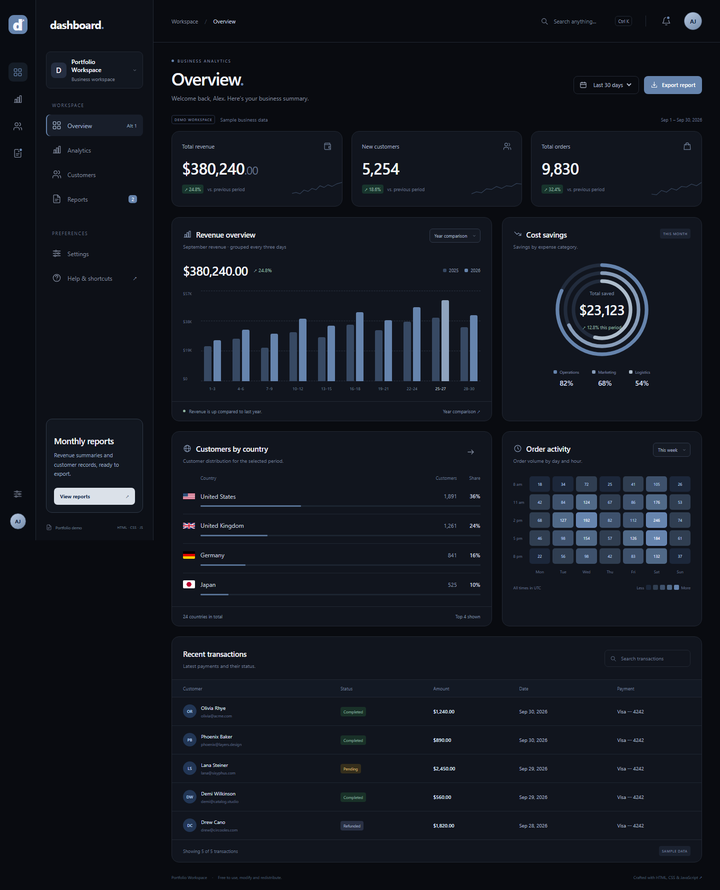

# Business Analytics Dashboard — Portfolio Project

A free, editable front-end **portfolio project** showcasing responsive UI development, accessible interactions, data visualization and reusable application configuration. Originally made for a personal portfolio; free to reuse and redistribute in your own projects. Sample data is included throughout.

A reusable business analytics dashboard with a black canvas, muted slate-blue accents and white typography. Built entirely with **HTML, CSS and vanilla JavaScript**. No framework, build step, remote fonts or JavaScript libraries. Country flags load from FlagCDN with bundled fallback images.



## Make it your own

Start with **`dashboard.config.js`**. Set your brand, workspace, profile, currency, accent palette, page titles, reports, customer records, regions and activity data in one file. Toggle individual dashboard sections using `sections`. Provide actual chart arrays to replace the demo's generated distributions.

For a step-by-step guide in Polish, see [CUSTOMIZE.md](CUSTOMIZE.md).

**Free to use, modify and redistribute.** You may use, copy, edit, customize and redistribute the dashboard code for any purpose. Replace the text, colors, layout and demo data to make it your own. No payment or attribution is required.

## Run locally

Open `index.html` in your browser, or use the optional Node.js preview server:

```sh
node .tools/server.cjs
```

Visit `http://127.0.0.1:4180`.

## Features

- Overview, analytics, customer directory and downloadable reports
- Reporting period filters and accessible interactive revenue charts
- Order activity heatmap with selectable weeks
- Searchable transactions, customer search and global search (`Ctrl/Cmd + K`)
- CSV export generated in the browser
- Three muted accent palettes saved with localStorage
- Central project configuration, currency formatting and optional dashboard sections
- Responsive navigation, native accessible dialogs and reduced-motion support
- Local sample data, explicitly identified as a demo
- Country flags from [FlagCDN / Flagpedia](https://flagpedia.net/download/api), with offline fallbacks and configurable ISO country codes

## GitHub Pages

Upload this folder to a GitHub repository. In **Settings → Pages**, choose **Deploy from a branch**, select your branch and `/ (root)`, and save. The relative asset paths also work under a repository subpath. No build workflow is needed.

## Project structure

```text
index.html          Semantic dashboard layout
dashboard.config.js Brand, theme, text, features and business data
styles.css          Theme, charts and responsive layouts
app.js              Sample data and all dashboard interactions
assets/flags/       Local country flags used if the CDN is unavailable
.tools/server.cjs   Optional local preview server
.tools/check.cjs    Browser interaction and responsive layout checks
```

The default configuration is a portfolio demonstration. Notifications, profile information and business records are sample content; there is no authentication or backend. Changing `demo` hides the sample-data badges but does not connect a backend: provide your own records before using that setting.

Country flag images are provided by [Flagpedia.net](https://flagpedia.net). The bundled images retain their source terms; the free-use permission above applies to the dashboard code.

## Browser checks

With the preview server running and Playwright installed in your test environment, run `node .tools/check.cjs`. Alternatively, set `DASHBOARD_PLAYWRIGHT_PATH` to an existing `@playwright/test` installation. The checks cover six viewport widths (320–1920px), navigation, keyboard access, filtering, CSV content, dialogs, saved colors and opening the page directly from disk. A separate configuration test verifies a custom brand, Polish currency formatting, actual chart arrays, optional sections and branded CSV exports. Screenshots are saved to the ignored `.verification` folder.

## Code style

Source files use two-space indentation, spaces around operators, semicolons and blank lines between functions. `.editorconfig` keeps editor settings consistent, and `.prettierrc.cjs` defines formatting for JavaScript, CSS and HTML. To format the project with Prettier:

```sh
npx prettier --write app.js dashboard.config.js styles.css index.html .tools/*.cjs
```

Prettier is only a development tool; running the dashboard does not require it. Browser checks also verify flag rendering, country code mapping, accurate share bars and local fallbacks when the CDN is unavailable.

## Usage

Free to use, modify and redistribute. There is no separate license file or restriction to portfolio use. The dashboard is provided as is, without warranty.
